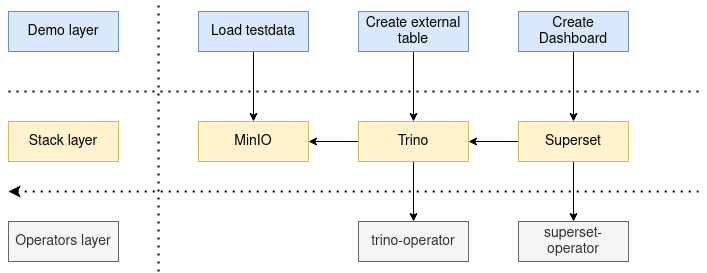

# stackablectl

# Installing

See the [docs](https://docs.stackable.tech/stackablectl/stable/installation.html) for detailed instructions.

# Usage
## List available releases
One good step to start using stackablectl is to list the available Releases with
```bash
$ ./stackablectl release list
```
You can also ask for the list of currently supported Product operators with
```bash
$ ./stackablectl operator list
```

# Building
You need to have Rust and go installed.
To build stackablectl execute `cargo build` or `cargo run` to run it.

We separate the deployed services into 3 layers:

| Layer         | Description                                                 | Examples                                      |
|---------------|-------------------------------------------------------------|-----------------------------------------------|
| **Operators** | The operators needed to operate the Stackable Data Platform | `trino-operator`, `superset-operator`         |
| **Stack**     | The data products                                           | `Trino`, `Apache Superset`                    |
| **Demo**      | The demos that prepare data and run the applications        | Demo loading and analyzing New York taxi data |



Each layer gets deployed via its dedicated `stackablectl` command

# Deploying
## Operators
Operators manage the products of the Stackable Data Platform.
This command can be used as a direct replacement of `create_test_cluster.py`.
We decided to drop dependency resolution (like the superset operator requires the commons-, secret-, druid-, trino-operator and a postgres) for the following reasons:
1. Imagine the situation "install `trino=1.2.3` and `superset`". Superset expresses a dependency on the latest Trino version.
Now the situation gets complicated because we have conflicting version requirements for the trino-operator.
We could try to resolve this using dependency trees and other magic stuff.
2. Even more important: When you deploy the superset-operator `stackablectl` has no way to know to which data products you want integrate with.
Because of this it would need to deploy the operators for **all** the products Superset supports.
As a result it would install like 90% of the operators by simply specifying Superset.
And all of that on possible non-fixed versions.

We also don't deploy examples any more as that functionality is now provided by the stack layer below.

## Stack
A Stack contains data products that are managed by Stackable operators. Additional products like MinIO, Prometheus and Grafana can also be included.

If you deploy a Stack with `stackablectl` it will automatically install the needed operators layer from the provided release.

## Demo
The highest layer - demo - is not really needed to spin up a Stackable Data Platform.
It enables us to run end-to-end demos with a single command.

If you deploy a Demo with `stackablectl` it will automatically install the needed stack and operators layers. 

# TODOs
* Check if CRD resources still exist when uninstalling the operators. If so warn the user.
* Use Result instead of panic!() in multiple places
